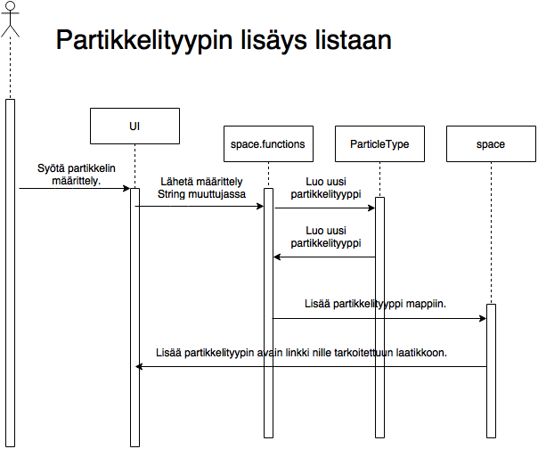
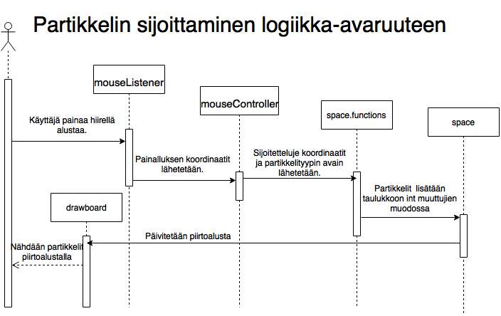

EmergenceVG: (EmergenceVisualGenerator)

Visuaali efektejä generoiva alusta visuaali esitysten luomiseen.

Toiminnot:

Partikkelityyppien lisääminen:

- Käyttäjä syöttää tekstikenttään partikkelityyppejä muodossa(nimi, lukujoukko1, lukujoukko2).
- Lukujoukot viittaavat partikkelia ympäröivien partikkelien määriin.
- Ensimmäinen lukujoukko listaa määrät joilla syntyy uusi partikkeli, kun taas toinen
ne määrät joilla partikkeli selviää seuraavaan vuoroon. Esim. Game of life: (life, 3, 2 3) Sulut jätetään pois
ohjelmaan kirjoitettaessa.
- Luku joukkoihin saa lisätä haluamansa määrän lukuja. Tosin vain luvuilla 1-8 on merkitystä, koska 8 
on maksimi määrä naapureita.
- Jos kenttään kirjoittaa esim. luvun 24, rekisteröi ohjelma sen lukuina 2 ja 4, koska 8 suuremmat luvut
olisivat kentässä merkityksettömiä.
- Kun käyttäjä on kirjoittanut määrittelyn kenttään tulee hänen painaa Enter nappulaa.

- Halutessaan käyttäjä voi myös ennen määrittelyä, valita partikkelille haluamansa värin ja muodon niille
tarkoitetuista laatikoista määrittelykentän alapuolella.

Esityksen luominen:

- Valittuja partikkeleita voi sijoittaa alustalle painamalla sitä hiirellä.

- Kun alustan suoritus on päällä, tallentuvat pelaajan interaktiot alustan kanssa muistiin.
- interaktiot voidaan siis uudelleen suorittaa, kun määrätään iterations muuttujan arvo
kohtaan jossa se oli interaktion tapahtuessa. Tämä tapahtuu syöttämällä se Iteration kenttään ja 
painamalla Enter alustan olleessa pysähtyneessä tilassa.
- Iterations on suorituksen alussa aina nollassa.

- Iteraatioiden etenemis nopeuden voi myös määrittää speed kentässä(Kirjoita arvo ja paina Enter). 
Myös speed muuttujan muokkaaminen tallentuu esitykseen.

Tallentaminen ja lataaminen:

- Luodut partikkelityypit ja käyttäjän Interaktiot(Luotu esitys) voidaan tallentaa
tiedostoon, jonka nimi on määritelty FileName kentässä painamalla Save painiketta.
- Vastaavasti Esitys voidaan ladata tiedostosta painamalla LoadPresentation painiketta.
- Jos tiedostosta halutaan vain luodut partikkelityypi voidaan käyttää LoadParticleTypes
painiketta.

Ohjelmasta poistuminen:

- Ohjelmasta poistutaan ohjelman käyttöliittymän oikeassa yläkulmassa sijaitsevaa 
x painiketta painamalla.
